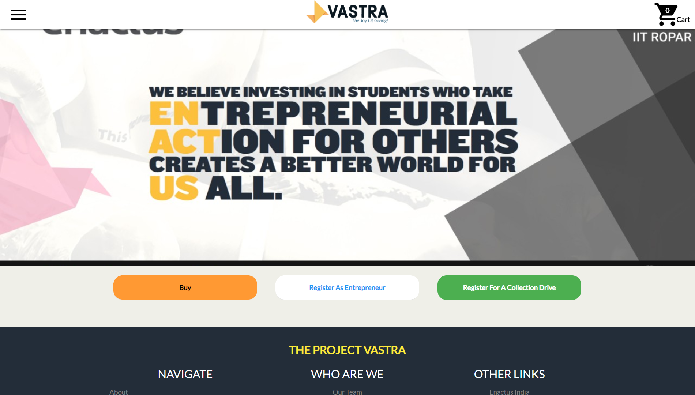
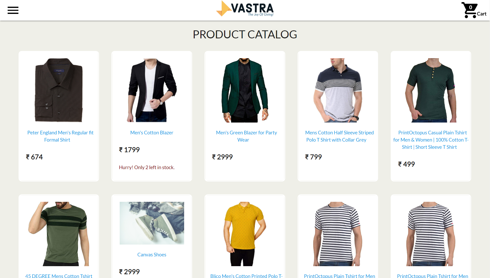
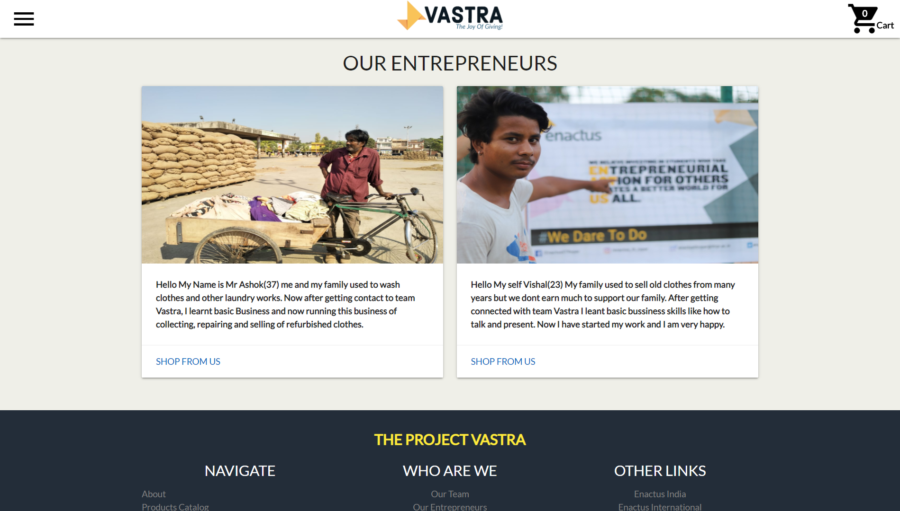
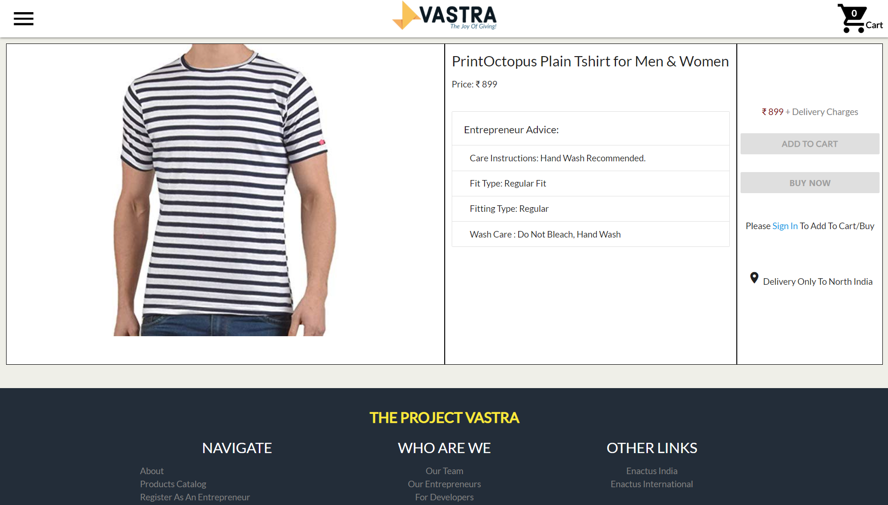

# Project Vastra
🛒 An E-Commerce Website under Enactus IIT Ropar which bridges the gap between our project entrepreneurs and buyers by providing a platform for easy selling and buying of clothes. 

## Brief Overview
**Food, shelter, and clothing** are the three major requisites for life. But it is disheartening to know that **one in every eight persons** in the world does not have adequate clothing. Then there is the prevalent problem of discarding old and worn out clothes. 
Recent studies have revealed that there is a huge number of people who discard their clothes each season while not reusing them or donating them. This is why Enactus IIT Ropar is working hard to address this issue through its initiative Vatsra. The project has left no stone unturned, from collaborating with numerous colleges to organizing countless cloth distribution camps, Vastra has done it all. 

The aim of this web portal is to scale our project to its maximum potential and make things streamlined!

## File Structure
```bash
src
│   README.md
│   manage.py
│
└───accounts # Acccounts module to handle user & entrepreneur auth 
│
└───cart # Django app to handles the cart of each user
│
└───customer # Contains rendering logic of landing, product catalog and static pages
│
└───payments # Payment module to handle the checkout and redirecting to payments gateway 
│
└───products # Django app to store and manage all the products
│
└───seller # Django app for the sellers
│
└───templates # Contains all HTML templates which are rendered by backend engine
│
└───theprojectvastra # Django main app
```


## Screenshots

<p align="right">
    
</p>
<br/>

<p align="left">
    
</p>
<br/>


<p align="left">
    
</p>
<br/>

<p align="right">
    
</p>
<br/>

